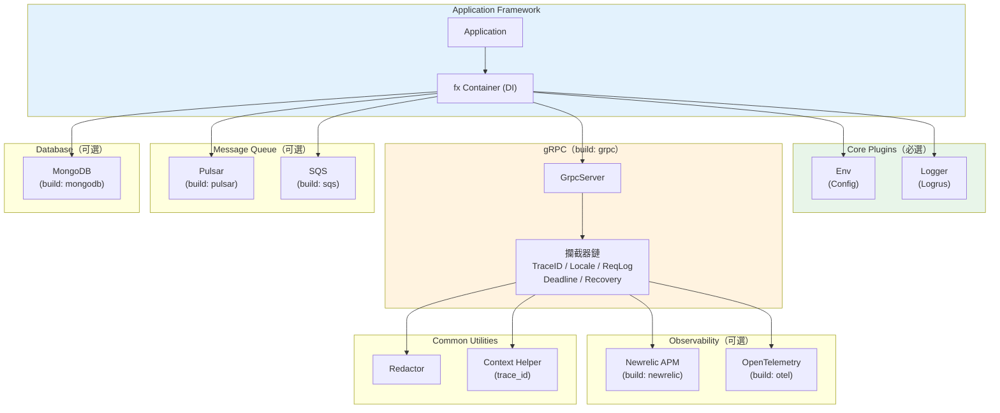

# go-app 專案完整文檔

## 1. 系統架構

**架構類型：** 領域驅動微框架（Domain-Driven Microframework）

go-app 是一個**可組合的 Go 應用框架**，採用：
- **依賴注入（DI）**：使用 `go.uber.org/fx` 作為 DI 容器
- **插件架構**：高度可擴展，支援選擇性加載（Build Tags）
- **模組化設計**：業務邏輯按模組組織，各模組相對獨立
- **自動初始化**：插件通過 `init()` 函數自動註冊到全局 Registry

```
Application (main)
    ↓ 依賴注入
 ┌──────────────────────────┐
 │   fx Container           │
 │  ┌──────────┐  ┌──────┐  │
 │  │ Plugins  │  │Module│  │
 │  │(Framework│  │(Biz) │  │
 │  └──────────┘  └──────┘  │
 └──────────────────────────┘
```

---

## 2. 目錄結構

```
go-app/
├── app.go                          # Application 類和 fx 初始化
├── module.go                       # AppModuleInterface 定義
├── fx.go                          # 自訂 Logger for Uber Fx 事件日誌
├── go.mod                         # 依賴管理
├── Makefile                       # 構建指令
├── README.md                      # 英文文檔
├── README_zh-TW.md               # 繁體中文文檔
│
├── common/                        # 共用工具
│   ├── context.go                 # Context trace_id 管理
│   ├── redactor.go               # 敏感資料脫敏
│   ├── ip.go                     # 主機名/IP 取得
│   ├── map.go                    # Map 合併工具
│   └── redactor_test.go
│
└── plugins/                       # 插件目錄
    ├── plugins.go                # 全局 Registry
    ├── env/                      # 環境變數管理
    ├── logger/                   # Logrus 日誌
    ├── grpc/                     # gRPC 伺服器（build tag: grpc）
    │   ├── grpc.go
    │   ├── error.go              # ApplicationError 類型
    │   └── interceptors/         # gRPC 攔截器（build tag: grpc）
    │       ├── trace_id.go
    │       ├── request_log.go
    │       ├── recovery.go
    │       ├── timeout.go
    │       ├── locale.go
    │       ├── newrelic.go
    │       └── opentelemetry.go
    ├── mongodb/                  # MongoDB（build tag: mongodb）
    ├── newrelic/                 # Newrelic APM（build tag: newrelic）
    ├── opentelemetry/            # OpenTelemetry（build tag: otel）
    ├── pulsar/                   # Apache Pulsar（build tag: pulsar）
    ├── sqs/                      # AWS SQS（build tag: sqs）
    ├── sqs_worker/               # SQS 消費者（build tag: sqs,sqs_worker）
    └── kitex/                    # ByteDance Kitex（build tag: kitex）
```

---

## 3. 主要模組及職責

| 插件 | Build Tag | 職責 |
|------|-----------|------|
| **Env** | -（必選） | 環境變數管理，支援 .env 和預設值 |
| **Logger** | -（必選） | Logrus 日誌適配 |
| **gRPC** | `grpc` | gRPC 伺服器，優雅關閉 |
| **MongoDB** | `mongodb` | MongoDB 連接和 CRUD，使用 mgm ODM |
| **Newrelic** | `newrelic` | APM 監控和追蹤 |
| **OpenTelemetry** | `otel` | 分散式追蹤 |
| **Pulsar** | `pulsar` | 訊息隊列，生產者/消費者/DLQ |
| **SQS** | `sqs` | AWS SQS 主題管理 |
| **SQS Worker** | `sqs,sqs_worker` | SQS 消費者實現 |
| **Kitex** | `kitex` | 字節跳動 Kitex RPC |

---

## 4. 使用套件

#### 核心依賴

| 套件 | 版本 | 用途 |
|-----|------|------|
| `go.uber.org/fx` | v1.17.1 | 依賴注入容器 |
| `google.golang.org/grpc` | v1.55.0 | gRPC 框架 |
| `sirupsen/logrus` | v1.9.2 | 日誌記錄 |
| `grpc-ecosystem/go-grpc-middleware` | v1.3.0 | gRPC 攔截器工具 |

#### 可選服務集成

| 套件 | 用途 |
|-----|------|
| `apache/pulsar-client-go` | Apache Pulsar 訊息隊列 |
| `aws/aws-sdk-go` | AWS 服務（SQS） |
| `cloudwego/kitex` | 字節跳動 Kitex RPC |
| `go.mongodb.org/mongo-driver` | MongoDB 驅動 |
| `kamva/mgm/v3` | MongoDB ODM |
| `newrelic/go-agent/v3` | Newrelic APM |
| `go.opentelemetry.io/*` | OpenTelemetry |
| `joho/godotenv` | .env 檔案載入 |
| `google/uuid` | UUID 生成 |

---

## 5. 編碼風格

### 命名慣例

- **包名**：小寫，單字（`env`, `logger`, `grpc`）
- **類型/結構體**：PascalCase（`Application`, `GrpcServer`, `Logger`）
- **函數/方法**：PascalCase（`NewLogger()`, `GetEnv()`, `AddModule()`）
- **常數**：UPPER_SNAKE_CASE（`MONGODB_CONNECTION_TIMEOUT`）
- **介面**：以 `Interface` 結尾（`AppModuleInterface`, `EventHandlerInterface`）

### AppModuleInterface 模式

```go
type AppModuleInterface interface {
    Controllers() []interface{}  // gRPC handler 構造函數
    Provide() []interface{}      // fx 依賴提供者
}
```

### ApplicationError（gRPC 錯誤）

```go
err := grpc.NewApplicationError(traceID, originalErr, codes.Internal, expected, details...)
// 包含 TraceID、gRPC status、預期/非預期標記，自動上報 Newrelic
```

### 攔截器模式

```go
type SomeInterceptor struct { ... }
func (i SomeInterceptor) Handler() grpc.UnaryServerInterceptor {
    return func(ctx, req, info, handler) (interface{}, error) { ... }
}
```

### 插件自動註冊

```go
//go:build grpc
func init() {
    plugins.Registry = append(plugins.Registry, fx.Provide(NewGrpcServer))
}
```

---

## 6. 調用路徑

### 啟動流程

```
main()
  ↓
NewApplication()
  ↓
app.AddModule(&MyModule{})
  ↓
app.Run(func(deps...) {})
  ↓
fx.New(plugins.Registry + module.Controllers + module.Provide)
  ↓
依賴解析：Env → Logger → GrpcServer + 攔截器 → 業務模組
  ↓
fx.Lifecycle.OnStart: GrpcServer.Serve()（port: GRPC_SERVER_PORT, 預設 3000）
```

### gRPC 請求處理鏈

```
Client Request
  ↓
TraceIdInterceptor     — 提取或生成 trace_id，設入 Context
  ↓
LocaleInterceptor      — 提取 locale，設入 Context
  ↓
RequestLogInterceptor  — 記錄請求（自動脫敏），記錄響應耗時
  ↓
NewrelicInterceptor    — 啟動 transaction，上報錯誤
  ↓
DeadlineInterceptor    — 設定超時（GRPC_HANDLER_DEFAULT_TIMEOUT）
  ↓
RecoveryInterceptor    — 捕捉 panic，轉換為 ApplicationError
  ↓
OtelInterceptor        — 分散式追蹤
  ↓
User Handler
```

### 敏感資料脫敏（Redactor）

```
request object
  ↓ common.DefaultRedactor.Redact()
  ↓
掃描 struct 字段，匹配過濾規則
FullRedact（password, address）→ "<REDACTED>"
PartialRedact（email, apiKey）  → "abc***"（保留前 30%）
```

---

## 7. 類別/結構圖

```mermaid
classDiagram
    class Application {
        -name string
        -fx *fx.App
        -plugins []interface{}
        +NewApplication() Application
        +AddModule(AppModuleInterface)
        +Run(funcs ...interface{})
        +Validate(funcs ...interface{}) error
    }

    class AppModuleInterface {
        <<interface>>
        +Controllers() []interface{}
        +Provide() []interface{}
    }

    class GrpcServer {
        -server *grpc.Server
        -logger *Logger
        -env *Env
        +Serve()
        +Shutdown()
        +Configure(opt ...grpc.ServerOption)
    }

    class ApplicationError {
        -traceID string
        -error error
        -code codes.Code
        -expected bool
        +Error() string
        +GRPCStatus() *status.Status
        +Expected() bool
        +TraceID() string
    }

    class Logger {
        +Info(msg string)
        +Error(msg string)
        +WithFields(logrus.Fields)
    }

    class Env {
        +GetEnv(key string) string
        +GetEnvInt(key string) int
        +SetDefaultEnv(map[string]string)
    }

    class MongoStore {
        +Connect(protocol, user, pass, hosts, db, params string)
        +Collection(name string) *mgm.Collection
    }

    class PulsarServer {
        +Connect(URL string) error
        +Shutdown()
    }

    class Redactor {
        +AddFilters(filters ...*Filter)
        +Redact(T any) any
    }

    Application o-- AppModuleInterface
    GrpcServer o-- Logger
    GrpcServer o-- Env
    MongoStore o-- Env
    MongoStore o-- Logger
    PulsarServer o-- Logger
```

---

## 8. 元件圖



---

## 9. 重要設計決策

### 1. Uber Fx 依賴注入
提供清晰依賴圖，自動管理生命周期。`app.Validate()` 可在不運行的情況下驗證依賴是否正確。

### 2. 插件 Build Tags + 自動 init 註冊
每個插件用 Build Tag 條件編譯，`init()` 自動加入全局 Registry，達到**零侵入的選擇性加載**。

### 3. ApplicationError 統一錯誤類型
包含 TraceID、gRPC status、預期/非預期標記，與 Newrelic 自動集成，便於問題追蹤。

### 4. Context Trace ID 傳播
`trace_id` 貫穿整個請求鏈（gRPC Context → Newrelic → OpenTelemetry → Pulsar 訊息 properties）。

### 5. 敏感資料自動脫敏
RequestLogInterceptor 自動通過 Redactor 脫敏，防止密碼/地址等敏感信息進入日誌。

### 6. 優雅關閉
fx.Lifecycle OnStop 鉤子確保 gRPC Server、Pulsar、SQS Worker 等都有完整的關閉流程。

---

## 10. 快速上手

### 環境要求

```bash
go version  # 需要 Go 1.18+
```

### 測試

```bash
make test
# 等同於
PROJECT_ROOT=$(pwd) go test -tags grpc,pulsar,newrelic,kitex ./...
```

### Build Tags 說明

| Tag | 啟用功能 |
|-----|---------|
| `grpc` | gRPC 伺服器 + 攔截器 |
| `newrelic` | Newrelic APM |
| `otel` | OpenTelemetry 追蹤 |
| `mongodb` | MongoDB |
| `pulsar` | Apache Pulsar |
| `sqs` + `sqs_worker` | AWS SQS 消費者 |
| `kitex` | Kitex RPC |

### 建立新模組

```go
type MyModule struct{ go_app.AppModuleInterface }

func (m *MyModule) Controllers() []interface{} {
    return []interface{}{ NewMyController }
}

func (m *MyModule) Provide() []interface{} {
    return []interface{}{
        func(logger *logger.Logger) *MyService { return &MyService{} },
    }
}

// main.go
app := go_app.NewApplication()
app.AddModule(&MyModule{})
app.Run(func() {})
```

### 主要環境變數

```env
ENVIRONMENT=development
LOG_LEVEL=debug
GRPC_SERVER_PORT=3000
GRPC_HANDLER_DEFAULT_TIMEOUT=30

# MongoDB
MONGODB_HOST=localhost:27017
MONGODB_USER=user
MONGODB_PASSWORD=password
MONGODB_DATABASE=mydb

# Newrelic
NEW_RELIC_LICENSE_KEY=xxx
NEW_RELIC_APP_NAME=my_app

# AWS SQS
AWS_REGION=us-east-1
AWS_ACCESS_KEY_ID=xxx
AWS_SECRET_ACCESS_KEY=xxx
```

### 常見問題

| 問題 | 原因 | 解決方案 |
|------|------|--------|
| 插件未載入 | 缺少 build tag | 加入 `-tags grpc` 等 |
| 依賴解析失敗 | 依賴順序錯誤 | 檢查 `Provide()` 的函數簽名 |
| 請求超時 | TIMEOUT 設定過低 | 調整 `GRPC_HANDLER_DEFAULT_TIMEOUT` |
| trace_id 為空 | 攔截器鏈缺少 TraceID | 確認 TraceIdInterceptor 在鏈中 |

---

## 11. 核心設計亮點

| 特性 | 說明 |
|------|------|
| **可組合插件** | Build Tag 條件編譯，按需加載 |
| **DI 生命周期** | fx 管理啟動/關閉順序 |
| **統一錯誤處理** | ApplicationError + TraceID 貫穿全鏈 |
| **多層攔截器** | 關注點分離，可自由組合 |
| **自動資料脫敏** | Redactor 保護日誌安全 |
| **多 APM 後端** | Newrelic + OpenTelemetry 可共存 |
| **多訊息隊列** | Pulsar + SQS 可並用 |
